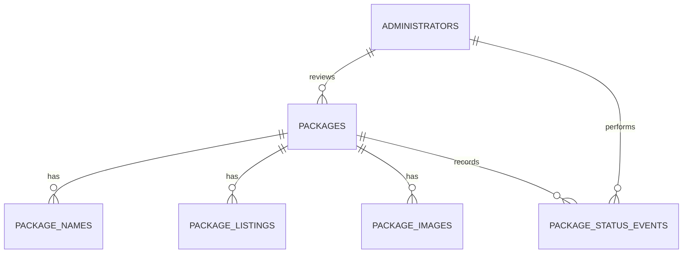

# Glocal Packages container app

This repository contains the Glocal container application: a single SvelteKit
app deployed as one Cloudflare Worker, backed by Cloudflare D1 (so the Prisma
datasource is SQLite-compatible). It serves the public package catalogue, the
public JSON API consumed by the iOS container app, the Scriptoria intake
endpoint, and the admin console for reviewing packages, alongside the Prisma
schema, migrations, and representative seed data.

## Documentation

All project documentation lives in [`docs/`](./docs).

### Guides

- [`docs/RUNNING.md`](./docs/RUNNING.md) — local development: prerequisites, secrets, database setup, and the route list.
- [`docs/DEPLOY.md`](./docs/DEPLOY.md) — deploying the Worker to Cloudflare staging and production.
- [`docs/SOURCE-CODE-BREAKDOWN.md`](./docs/SOURCE-CODE-BREAKDOWN.md) — beginner-friendly map of the codebase for readers new to SvelteKit.
- [`docs/NON-TECH.md`](./docs/tickets/NON-TECH.md) — how non-technical collaborators can contribute, including working through AI assistants.
- [`docs/AGENT-CONTEXT.md`](./docs/AGENT-CONTEXT.md) — handoff notes for AI assistants working in this repository.

Hackathon tickets (indexed in [`docs/README.md`](./docs/tickets/README.md), one file per ticket with story, acceptance criteria, and dependencies):

- `docs/BE-001` … `BE-019` — backend tickets (schema, ingestion, sessions, roles, tests).
- `docs/FE-001` … `FE-017` — frontend tickets (app shell, search, localization, admin UI).
- `docs/OPS-001` … `OPS-016` — DevOps/deployment tickets (environments, CI, secrets, monitoring).

## Current decisions

- Cloudflare D1 is the hackathon database.
- The future Worker binding will be named `DB`.
- The staging database will be named `glocal-packages-staging`.
- Public package consumers do not sign in. Only administrators have application
  accounts, using app-managed credentials.
- Every administrator requires a password hash. The development seed contains
  an intentionally unusable placeholder until the bootstrap flow is built.
- The Scriptoria product UUID is the external idempotency key.
- Every newly received package begins in `PENDING` status. The notification
  payload is never allowed to choose its own moderation status.
- The public catalogue returns only `ACTIVE` packages.
- API credentials remain Worker secrets for the MVP and are not stored in this
  schema yet.

## Data model



The minimum models are:

- `Package`: one logical Scriptoria product and its current moderation status.
- `PackageName`: searchable primary and alternative language names.
- `PackageListing`: localized public title and descriptions.
- `PackageImage`: resolved image URLs for each scale.
- `Administrator`: app-native account for package review and management.
- `PackageStatusEvent`: append-only moderation history.

The full notification can optionally be retained as `rawNotificationJson`, but
the application must use the normalized columns and relations for business
logic. Listing descriptions are untrusted HTML and must be sanitized before
rendering.

A more detailed rendering can be found at [docs/database.md](docs/database.md).

## Current endpoints and files

| Endpoint Name                       | Web Path                                  | Handler File                                            |
| :---------------------------------- | :---------------------------------------- | :------------------------------------------------------ |
| Root Page Load                      | `/` (GET)                                 | `src/routes/+page.server.ts`                            |
| Login Form                          | `/login` (GET)                            | `src/routes/login/+page.server.ts`                      |
| Login Action                        | `/login` (POST)                           | `src/routes/login/+page.server.ts`                      |
| Health Check                        | `/health` (GET)                           | `src/routes/health/+server.ts`                          |
| Search Packages API                 | `/api/v1/packages` (GET)                  | `src/routes/api/v1/packages/+server.ts`                 |
| Get Package Details API             | `/api/v1/packages/:id` (GET)              | `src/routes/api/v1/packages/[id]/+server.ts`            |
| Scriptoria Notification Ingest      | `/api/v1/notifications/scriptoria` (POST) | `src/routes/api/v1/notifications/scriptoria/+server.ts` |
| Logout Handler                      | `/logout` (POST)                          | `src/routes/logout/+server.ts`                          |
| Admin Page Load / Moderation Action | `/admin` (GET/POST)                       | `src/routes/admin/+page.server.ts`                      |

## Install and validate

```bash
npm install
npm run db:check
```

Useful individual commands:

```bash
npm run db:format
npm run db:validate
npm run db:generate
```

The generated Prisma client is ignored by Git and will be created at
`src/lib/server/generated/prisma`. The future Cloudflare MVP can import it from
server-only code and construct it with `@prisma/adapter-d1` and `env.DB`.

## Initial migration

`migrations/0001_initial.sql` is generated from `prisma/schema.prisma` using:

```bash
npm run db:migration:initial
```

Do not overwrite a migration after it has been applied to a shared database.
For later changes, create a new numbered migration and compare the current local
D1 schema to the updated Prisma schema.

When the Cloudflare MVP adds Wrangler configuration, apply the committed
migrations locally first:

```bash
npx wrangler d1 migrations apply glocal-packages-staging --local
npx wrangler d1 execute glocal-packages-staging --local --file prisma/seed.sql
```

After local integration succeeds and the SQL has been reviewed, apply it to the
remote staging database:

```bash
npx wrangler d1 migrations apply glocal-packages-staging --remote
```

The seed is representative development data only. Do not apply it to production.

## REST notification mapping

| Notification field                     | Database destination          |
| -------------------------------------- | ----------------------------- |
| Product UUID from `permalink_url`      | `Package.scriptoriaProductId` |
| Project, publish, and permalink fields | `Package`                     |
| Cleaned `size`                         | `Package.sizeBytes`           |
| `app_lang`                             | `Package` and `PackageName`   |
| `listing[]`                            | `PackageListing`              |
| `image.files[]`                        | `PackageImage`                |
| Request receipt                        | `Package.lastNotificationAt`  |

The ingestion handler must validate and normalize the notification before
writing it. In particular, the supplied example's `"11351769}"` size becomes the
integer `11351769`.

## Intentionally deferred

The following are not required to close the first notification-to-download
workflow and should be added through later migrations only when their behavior
is confirmed:

- Managed API-credential lifecycle
- Interface and branding settings
- Email delivery history
- R2 object metadata
- Multiple package-publication versions
- General administrative audit events beyond package status changes

One product decision remains open: whether a republished `ACTIVE` package stays
active or returns to `PENDING`. The schema supports either policy; the ingestion
service must not silently choose it without SIL confirmation.

## TODO

- [ ] Cleanup documentation
  - [ ] This readme file needs some work as some of these steps changed through the weekend
  - [ ] The files under docs need to be cleaned up and verified that the information is correct. An AI agent did the work of writing most of those, but we ran out of time for verification.
- [x] AGENTS.md considerations
  - [x] There is an AGENT-CONTEXT.md file that may be too verbose, but it does need to be compared to the AGENTS.md and potentially the two combined in some places
- [ ] Consider the UI/UX of the current design.
  - [ ] Does the download button concept work? Or do we want the user to click on the row and it download?
  - [ ] Do we want to show file details?
- [ ] Connect Scriptoria API
- [ ] Ensure that the deploy to Cloudflare is completely functional
  - [ ] D1 Database migration
  - [ ] Verify that workers are the path that we need to accomplish our goals
  - [ ] Make sure served files deploy correctly to Cloudflare and are accessible (permissions)
- [ ] Refactoring to make commands easier for our average user to execute them
  - [ ] Ensure that forking, configuration, and deployment are fairly straight forward for our average user
  - [ ] Some combination of commands might be helpful
  - [ ] Consider creating test cases that a user can run to feel confident that container-app-server is installed correctly
- [ ] Double check for potential security issues; use [Security Concerns](/docs/security_concerns.md) as a starting point(this was a very quick project and care needs to be taken to ensure that security is properly addressed)
