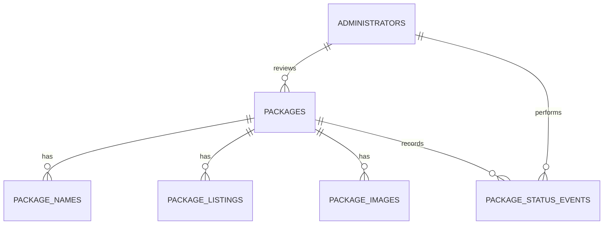

# Glocal packages Cloudflare MVP

This repository contains the first Cloudflare-hosted vertical slice for the
Glocal package catalogue. SvelteKit serves the public and administrator pages
and its server routes run as a Cloudflare Worker backed by D1.

The MVP flow is:

1. Scriptoria sends a package notification with a shared API credential.
2. The Worker validates and stores the package as `PENDING`.
3. An authenticated administrator approves or rejects it.
4. Only `ACTIVE` packages appear in the public catalogue and API.
5. The user follows the existing Scriptoria `publishUrl` to download it.

R2 mirroring and notification email are intentionally deferred.

## Current decisions

- Cloudflare D1 is the hackathon database and its Worker binding is `DB`.
- Public package consumers do not sign in; only administrators have accounts.
- Administrator credentials are app-managed and stored as password hashes.
- The Scriptoria product UUID is the external idempotency key.
- New packages always begin as `PENDING`.
- Repeated notifications update metadata without silently resetting moderation.
- Scriptoria and session credentials are Worker secrets, not database fields.

## Routes

| Method | Path | Access | Purpose |
|---|---|---|---|
| `GET` | `/` | Public | Search and download active packages |
| `GET` | `/health` | Public | Worker and D1 health |
| `POST` | `/api/v1/notifications/scriptoria` | Scriptoria secret | Idempotent package ingestion |
| `GET` | `/api/v1/packages?q=...` | Public | Search active packages |
| `GET` | `/api/v1/packages/:id` | Public | Active package details |
| `GET`, `POST` | `/login` | Public | Administrator login page and form action |
| `GET`, `POST` | `/admin` | Administrator | Review queue and moderation action |
| `POST` | `/logout` | Administrator | Delete the session cookie |

## Data model



The complete notification may be retained as `rawNotificationJson`, but
business logic uses the normalized columns and relations. Listing descriptions
are untrusted HTML and must be sanitized before rendering.

## Local setup

Node.js 22 or newer is required.

```bash
npm install
cp .dev.vars.example .dev.vars
npm run db:migrate:local
npm run db:seed:local
npm run dev
```

`npm run dev` builds the Cloudflare Worker and starts Wrangler at
`http://localhost:8787`. The seed package remains `PENDING` to match production
ingestion policy, so it is intentionally absent from the public API until an
administrator approves it.

Use development-only values in `.dev.vars`. Never commit real Scriptoria or
session credentials.

Run the validation suite with:

```bash
npm run check
npm run types:check
npm run deploy:dry-run
```

## Database and Prisma

- `prisma/schema.prisma` is the application model.
- `migrations/0001_initial.sql` is the committed D1 migration.
- `prisma/seed.sql` contains representative local data only.
- The generated client is placed in `src/lib/server/generated/prisma` and is
  ignored by Git.

Useful commands:

```bash
npm run db:format
npm run db:validate
npm run db:generate
npm run db:migrate:local
npm run db:seed:local
```

Do not rewrite a migration after it has been applied to a shared database. Do
not run `prisma migrate dev` or `prisma db push` against D1. Generate and review
SQL, commit it, then apply it with Wrangler.

Prisma is used for typed queries. Multi-statement ingestion and moderation
writes use D1 `batch()` because the Prisma D1 adapter does not provide the
transaction guarantees required by those operations.

## Scriptoria notification mapping

| Notification field | Database destination |
|---|---|
| Product UUID from `permalink_url` | `Package.scriptoriaProductId` |
| Project, publish and permalink fields | `Package` |
| Cleaned `size` | `Package.sizeBytes` |
| `app_lang` | `Package` and `PackageName` |
| `listing[]` | `PackageListing` |
| `image.files[]` | `PackageImage` |
| Request receipt | `Package.lastNotificationAt` |

The supplied example's malformed `"11351769}"` size is normalized to the
integer `11351769`.

## Connect Cloudflare staging

The checked-in D1 IDs and allowed origins are placeholders. Authenticate the
Wrangler CLI and list the account's databases:

```bash
npx wrangler login
npx wrangler d1 list
```

Replace the staging placeholder in `wrangler.jsonc`, then configure secrets
interactively:

```bash
npx wrangler secret put SCRIPTORIA_API_KEY --env staging
npx wrangler secret put SESSION_SECRET --env staging
```

Apply the migration and deploy:

```bash
npm run db:migrate:staging
npm run deploy:staging
```

The development seed must not be applied to production.

## Administrator bootstrap

The seeded administrator has an intentionally unusable password hash. Before
testing administrator login, provision a hash in the format produced by the
Worker's `hashPassword` helper:

```text
pbkdf2$<iterations>$<saltB64>$<hashB64>
```

Never store or print the plaintext password.

## Deferred work

- Managed API-credential lifecycle
- R2 package mirroring
- Administrator email alerts
- Interface and branding settings
- Multiple publication versions
- Production migration recovery and backup automation

One product decision remains open: whether a republished `ACTIVE` package stays
active or returns to `PENDING`. The current ingestion implementation preserves
its existing status until SIL confirms another policy.
