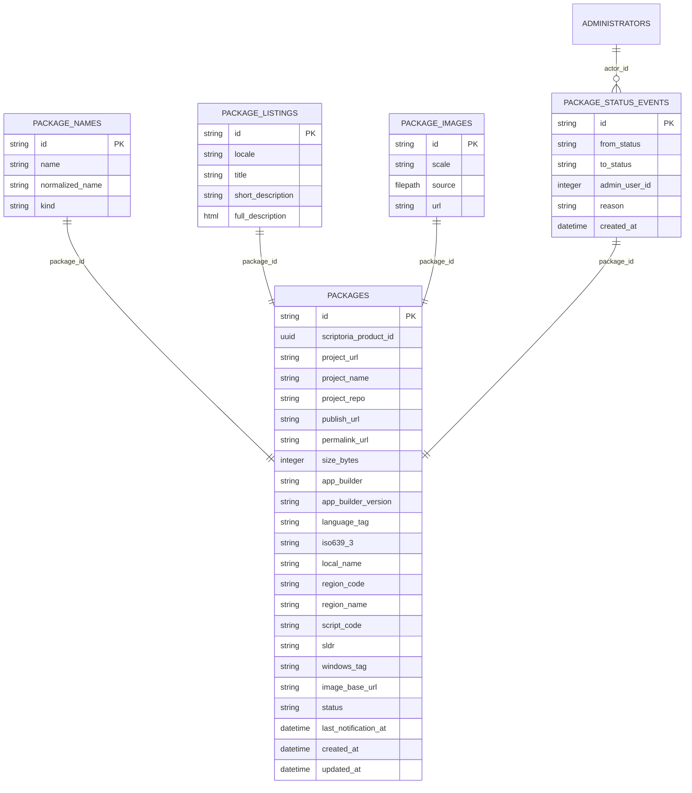

# Detailed Database Model

## Table Summary

| Table                   | Rows (seed) | Purpose                                                                  |
| ----------------------- | ----------- | ------------------------------------------------------------------------ |
| `administrators`        | 1           | Authenticated admin users                                                |
| `packages`              | 4           | Bible asset packages (Gumawana, Quenya Elvish, Klingon, Hawaiian Pidgin) |
| `package_names`         | 13          | Primary/alternate/local language names per package                       |
| `package_listings`      | 8           | Localized product listings with titles and descriptions                  |
| `package_images`        | 9           | Retina image assets (1x/2x) for nav drawer                               |
| `package_status_events` | 5           | Audit trail of status transitions                                        |

## Seed Data Coverage

- **Notification → Pending → Approval demo path** — admin actor (`usr-demo-admin`) triggers a pending→active transition on Quenya Elvish.
- **Auth placeholder** — admin account present but with an unusable password hash; intended to be replaced via bootstrap flow before real auth testing.
